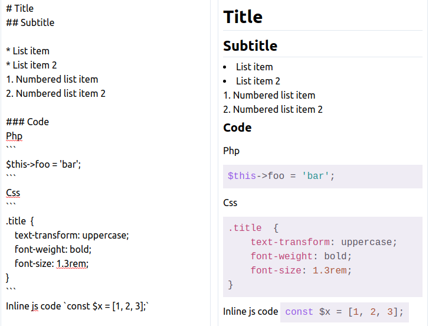

[](https://packagist.org/packages/sinnbeck/markdom)
[](https://packagist.org/packages/sinnbeck/markdom)


# Introduction

Markdom is a laravel package to make it simple to convert markdown to beautifully rendered html. It adds classes and allows you to automatically do code highlighting.



### Credits
* Markdown parsing: [CommonMark](https://github.com/thephpleague/commonmark)
* DOM manipulation: [HtmlPageDom](https://github.com/wasinger/htmlpagedom)
* Code highlighting: [highlight.php](https://github.com/scrivo/highlight.php) 

## Installation
Install the package using composer
```
$ composer require sinnbeck/markdom
```

After that is a good idea to add the facade to your `config/app.php` aliases array.
```
'Markdom' => Sinnbeck\Markdom\Facades\Markdom::class,
```

## Publish the config
To publish the config file simply run the following to add `markdom.php` to your config directory.
```
php artisan vendor:publish --tag=markdom-config
```

## Usage
Markdom comes with a blade helper to easily convert markdown to html
```
@markdom($markdown)
```
You can also call it though the facade
```
Markdom::toHtml($markdown)
```

## Configuration
The main feature of Markdom is to add classes to your rendered html. This requires you to set up a class map in `markdom.php`. This determines which elements are getting what classes.
Here is a quick example using TailwindCss syntax.
```
    'classes' => [
        'h1'     => 'text-3xl font-bold mt-1 mb-2 border-b',
        'h2'     => 'text-2xl font-bold my-1 border-b',
        'h3'     => 'text-xl font-bold my-1',
        'p'      => 'py-2',
        'ul'     => 'list-disc list-inside',
        'ul ul'  => 'pl-8 list-disc list-inside',
        'ol'     => 'list-decimal list-inside',
        'pre'    => 'my-1'
    ],
```
The key can be any css selector, meaning you can also do `ul > li > ul` or even `.classname`. The classes are parsed in the order that they are listed in the config, meaning you can add additional classes to those set before.

```
    'classes' => [
        'h1'     => 'title text-3xl ',
        'h2'     => 'title text-2xl',
        'h3'     => 'title text-xl',
        '.title' => 'font-bold border-b',
    ],
```
The above will add the class title to the header elements, and the then `'font-bold border-b'` to each. \
Result:
```
<h1 class="title text-3xl font-bold border-b">Title</h1>
<h2 class="title text-2xl font-bold border-b">Subtitle</h2>
<h3 class="title text-xl font-bold border-b">More</h3>
```

## Markdown configuration
It is possible to tweak the parsing of markdown. Under the hood, Mardom uses `league/commonmark`, meaning all settings under the `commonmark` key, is just sent directly to CommonMark.
See a list of available setting here: https://commonmark.thephpleague.com/1.5/configuration/#configuration

### Markdown extensions
CommonMark comes with a lot of extensions. These can be added to the `commonmark.extensions` array which will make them automatically load.
See a list of available extensions here: https://commonmark.thephpleague.com/1.5/extensions/overview/

## Code highlighting
If you are using markdown for parsing code, you may enable the code highlighter, by setting `MARKDOM_CODE_HIGHLIGHT=true` in your .env file. This will automatically add highlight.js classes to the code found in code tags.
 
 CommonMark will convert \`somecode\` and \
 \``` \
 somecode \
 \``` \
 to `<code>somecode</code>` and `<pre><code>somecode</code></pre>` which will be passed to `scrivo/highlight.php` (a php implementation of highlight.js).
 
### Highlight theme and css
 It is possible to have your code styled automatically. This can be done simply by adding the `@markdomStyles()` directive to your page. This will embed the highlight.js css into your page. You can pass the name of a theme to the method, to get a specific stylesheet `@markdomStyles('purebasic')`
 
### Highlighting theme
 Highlight.js supports 91 themes currently. You can get an array of these themes by using `Markdom::getAvailableThemes()`. This can be useful for rendering a select, if the user is allowed to select theme.
```
<select>
    @foreach(Markdom::getAvailableThemes() as $style)
        <option value="{{$style}}">{{$style}}</option>
    @endforeach
</select> 
```

### Examples
Controller (markdown can be also be loaded from database or a file)
```
    public function index()
    {
        $markdown = 
<<<markdown
# Title
## Subtitle

* List item
* List item 2
1. Numbered list item
2. Numbered list item 2

### Code

\```
$this->foo = 'bar';
\```

Inline code `const $x = [1, 2, 3];`

### Text formatting
**Bold** \
__Bold__ \
_Italic_ \
~~Crossed~~

### Escaped html
<script>alert()</script>
markdown;

        return view('markdown.index', compact('markdown'));
    }
```
index.blade.php
```
@extends('layouts.app')
@section('content')
    @markdom($markdown)
@endsection
```
#### Livewire
Markdom also works great with Livewire and does not require any javascript.

You can get a working example of an autoupdating markdown editor using livewire here: https://github.com/sinnbeck/markdom-livewire

## Testing
Run tests with
```
vendor/bin/pest
```

## Todo

- [ ] Handle loading of highlight styles using <link syntax
- [ ] Minification of highlight styles
- [ ] Guide for using cdn version of highlight styles (inline code breaks!)
- [ ] Look into passing manually set language to highlight.php
